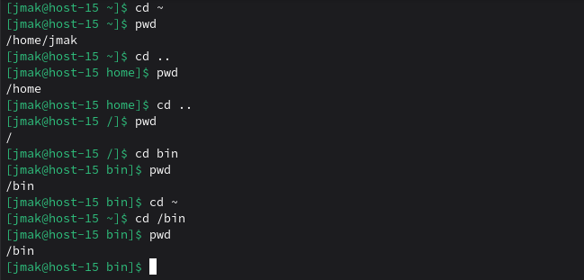
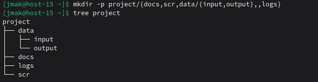
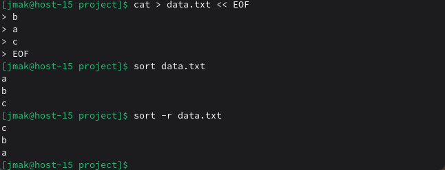

# Работа в консоли Linux

### 1) Переместиться между директориями

Перемещение в домашнюю, на уровень выше, в корневую 
```
cd ~
pwd
cd ..
pwd
cd ..
pwd
cd bin
pwd
cd ~
cd /bin
pwd
```


### 2) Вывести список файлов в директории

Список файлов (без скрытых) текущей директории в длинном формате:

```
ls -l
```

### 3) Вывести список всех файлов в директории

Все файлы включая скрытые:
```
ls -la
```

### 4) Создать папку с подпапками

Создадим структуру папок для проекта:
```
mkdir -p project/{docs,src,data/{input,output},logs}
tree project
```


### 5) Внутри папки создать файлик и записать в него что-нибудь

Создадим файл с текстом в директории docs:
```
echo "тестовый файл" > project/docs/test.txt
cat project/docs/test.txt
```

### 6) Переместить файл из одной директории в другую

Переместим файл из docs в data/input:
```
mv project/docs/test.txt project/data/input/
ls project/docs
ls project/data/input
```

### 7) Скопировать файл из одной директории в другую

Скопируем файл из input в output:
```
cp project/data/input/test.txt project/data/output/
ls project/data/output
```

### 8) Переименовать файл

Переименуем файл в output:
```
mv project/data/output/test.txt project/data/output/new_name.txt
ls project/data/output
```

### 9) Сравнить содержимое файла

Создадим два файла для сравнения:
```
echo "строка1" > file1.txt
echo "строка2" > file2.txt
diff file1.txt file2.txt
```

### 10) Отсортировать содержимое файла по возрастанию и убыванию

Создадим файл с данными и отсортируем:
```
cat > data.txt << EOF
b
a
c
EOF
sort data.txt
sort -r data.txt
```


### 11) Удалить все папки и файлы

Удалим созданную структуру:
```
rm -rf project
rm -f file1.txt file2.txt data.txt
ls -ld project 2>/dev/null || echo "Папка удалена"
```