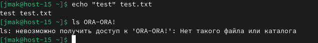
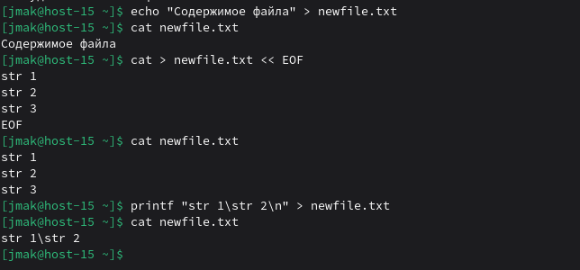

# Перенаправляем

### 1) Как работают команды >,>>?
">" (перенаправление вывода с перезаписью) - создает новый файл или перезаписывает существующий:
```
echo "Первая строка" > file.txt
cat file.txt
```
">>" (перенаправление вывода с дополнением) - добавляет вывод в конец файла:
```
bash
echo "Первая строка" > file.txt
echo "Вторая строка" >> file.txt
cat file.txt
```


### 2) Что такое перенаправление ввода? stderr,stdout;

Перенаправление ввода/вывода - механизм для управления потоками данных между программами и файлами.
```
- stdout (стандартный вывод, дескриптор 1) - куда программа выводит обычные результаты, по умолчанию: экран терминала
- stderr (стандартный вывод ошибок, дескриптор 2) - куда программа выводит сообщения об ошибках, по умолчанию: тоже экран терминала
- stdin (стандартный ввод, дескриптор 0) - откуда программа получает входные данные, по умолчанию: клавиатура
```


### 3) Вывести содержание файла не используя текстовые редакторы;

```
cat file.txt
head -n 5 file.txt
tail -n 5 file.txt
less file.txt
more file.txt
```
less - открывает файл для постраничного просмотра (удобно для больших файлов)
more - аналогично less, но с ограниченной функциональностью

### 4) Создать файл с содержимым не используя текстовые редактор;

```
echo "Содержимое файла" > newfile.txt

cat > newfile.txt << EOF
Строка 1
Строка 2
Строка 3
EOF

printf "Строка 1\nСтрока 2\n" > newfile.txt
```


### 5) пернеаправить stdout в stderr и обратно на примере команды kinit, ping, tracert
`stdout` в `stderr`:
```
ping -c1 localhost 2> err.txt 1>&2
```

`stderr` в `stdout`:
```
ping -c1 999.999.999.999 2>&1
```


### 6) чем отличаются stdout и stderr

stdout - это поток для основных результатов работы программы: данные, информация, итоги вычислений. Например, список файлов от ls или содержимое файла от cat. По умолчанию построчно буферизируется.

stderr - это поток для вспомогательных сообщений программы: ошибки, предупреждения, диагностическая информация, логи. Например, сообщение "файл не найден" или "доступ запрещён". Обычно выводится сразу без буферизации.

### 7) что такое stdin?

stdin (стандартный ввод, 0) - поток данных, который программа получает для обработки
- По умолчанию: клавиатура
- Можно перенаправлять из файлов или других команд
- Используется для интерактивного ввода

### 8) как отправить весь вывод команды в пустоту?

```
ping -c3 localhost > /dev/null 2>&1
```