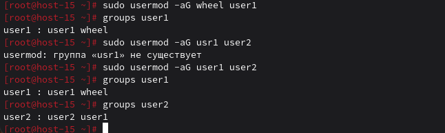
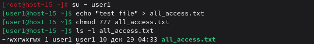

# Управление пользователями

### 1) Добавьте пользователей user1 и user2:

Стань root
```
su
```
Ввод пароля root

#### 1.1) user1 - оболочка bash

```
useradd -m -s /bin/bash user1
```

#### 1.2) user2 - оболочка sh

```
useradd -m -s /bin/sh user2
```

#### 1.3) установите им пароли

```
passwd user1
```
Ввод пароля дважды для user1
```
passwd user2
```
Введи пароля дважды для user1

### 2) Назначьте пользователю 1 группу администраторов, польователя 2 добавте в группу пользователя 1

Добавляем user1 в группу sudo (администраторы)
```
sudo usermod -aG sudo user1
```

Добавляем user2 в группу user1
```
sudo usermod -aG user1 user2
```

Проверка
```
groups user1
groups user2
```

### 3) Что такое права доступа? Выведите права доступа на файлы в директории пользователя

Права доступа - это система разрешений, определяющая кто и что может делать с файлом или директорией. Состоят из трёх категорий:

- Владелец (user) - создатель файла;
- Группа (group) - пользователи в одной группе с владельцем;
- Остальные (others) - все остальные пользователи;

Для каждой категории три типа прав:

- r (read) - чтение (4)

- w (write) - запись (2)

- x (execute) - выполнение (1)
```
sudo ls -la /home/user1/
```

### 4) Как изменить права на файлы? Создайте файл который будет на который у всез пользователей будут все возможные права

Переключаемся на user1, Создаём файл, Даём всем полные права (rwxrwxrwx)
```
su - user1
echo "test file" > all_access.txt
chmod 777 all_access.txt
ls -l all_access.txt
```


Способы изменения прав:

- Числовой: chmod 777 file (rwxrwxrwx)
- Символьный: chmod a+rwx file (всем все права)

### 5) Как называется учётная запись встренного администратора в linux?

root - суперпользователь с максимальными привилегиями.

### 6) Как выполнить команду от имени администратора?

```
sudo команда
```
или переключиться в root:
```
su -
```
Ввод пароля
### 7) Есть ли ограничения у суперпользователя?

Теоретически root всемогущ, но на практике его ограничивают SELinux/AppArmor, read-only файловые системы, защищённые системные файлы и "защита от дурака" вроде блокировки rm -rf /

### 8) Удалите пользователя 2 с помощью пользователя 1.

```
su - user1
sudo userdel -r user2
getent passwd | grep user2
```

### 9) Как можно изменить владельца папки? измените владельца папки из пункта 4

```
sudo chown user1:user1 all_access.txt
sudo chown -R user1:user1 /home/user1/
ls -l all_access.txt
```

Команды для изменения владельца:
- chown user file - меняет владельца
- chown user:group file - меняет владельца и группу
- chown :group file - меняет только группу
- chown -R user dir - рекурсивно для директории