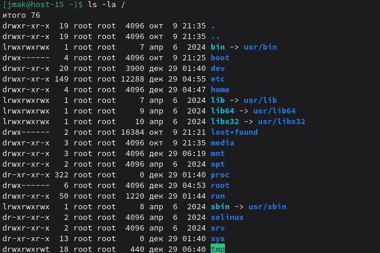

# Струтура каталогов

### 1) Какая структура каталогов в linux? выведите список файлов в корне системы

```
ls -la /
```


Основные каталоги (FHS):

- / - корневая директория
- /bin - основные исполняемые файлы
- /etc - конфигурационные файлы
- /home - домашние папки пользователей
- /var - изменяемые данные
- /tmp - временные файлы
- /usr - пользовательские программы и данные
- /boot - файлы загрузки
- /dev - файлы устройств
- /proc, /sys - виртуальные файловые системы

### 2) Где хранятся папки пользователей в системе?

В директории /home/

### 3) Где домашняя папка суперпользователя?

/root/ - домашняя папка root
```
/root/ - домашняя папка root
```

### 4) Где хранятся основые конфигурационные файлы в системе?

В директории /etc/

### 5) ЧТо за папки /bin,/sbin,usr/sbin,/usr/sbin

- /bin - основные исполняемые файлы (доступные всем)
- /sbin - системные утилиты (требуют root)
- /usr/bin - пользовательские программы
- /usr/sbin - системные программы для администратора