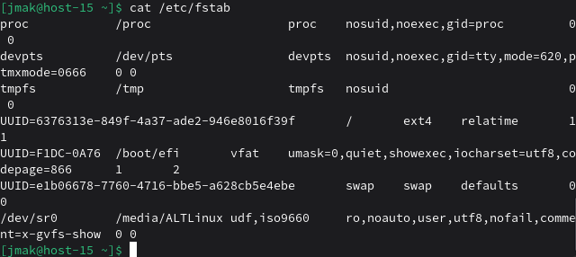
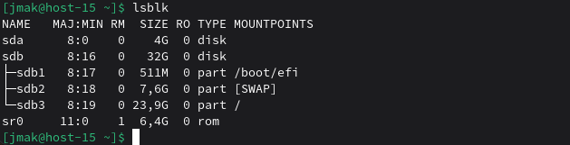
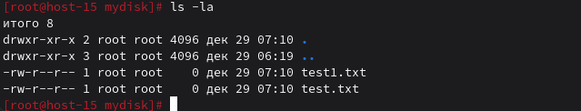

# Продолжаем

### 1. Выведите содержимое fstab. Что хранится в fstab?

```
cat /etc/fstab
```

fstab - таблица файловых систем, содержит информацию о автоматическом монтировании дисков при загрузке.
### 2. Добавьте в виртуальную машину ещё один диск

Готово!

### 3. Узнайте как ситема видит ваш диск - выведите информацию о блочных устройствах



### 4. С помощью полученной информации создайте на диске таблицу разделов и фаловую систему ext4

Создать раздел
```
sudo fdisk /dev/sdb
```
В fdisk: n → p → 1 → Enter → Enter → w
```
Создать файловую систему
```
sudo mkfs.ext4 /dev/sdb1


### 5. Примонитруте диск в каталог /mnt

```
sudo mkdir /mnt/mydisk
sudo mount /dev/sdb1 /mnt/mydisk
```

### 6. Зайдите в каталог и создайте там файлы

```
cd /mnt/mydisk
sudo touch test1.txt test2.txt
ls -la
```

### 7. Отмонтируйте диск и проверье остались ли файлы

```
cd /
sudo umount /mnt/mydisk
ls /mnt/mydisk/  # папка пустая
```

### 8. Сделайте так чтобы диск автоматически подключался при загрузке систем ( добавьте информацию о нём с fstab)

Узнаем UUID диска
```
sudo blkid /dev/sdb1
```

Добавляем в fstab
```
echo "UUID=ваш-uuid /mnt/mydisk ext4 defaults 0 2" | sudo tee -a /etc/fstab
```

### 9. Проверьте корретность записанных в fstab данных перед перезагрузкой

```
sudo mount -a
ls /mnt/mydisk/  # должны увидеть файлы test1.txt, test2.txt
```

### 10. Перезагрущите систему и убедитесь что диск был подключён к системе

```
sudo reboot
```
После загрузки:
```
ls /mnt/mydisk/
df -h | grep mydisk
```
