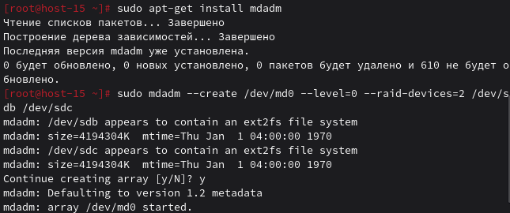
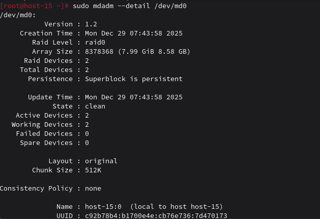
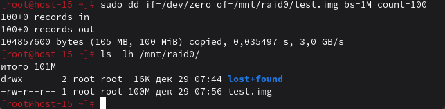
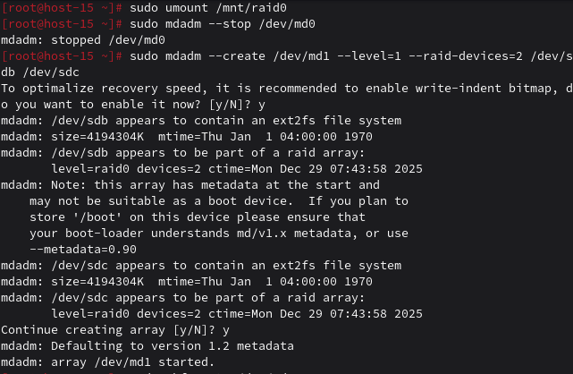

# Продолжаем

1. Raid массивы, что такое икакие бывают

RAID (Redundant Array of Independent Disks) - объединение дисков для повышения производительности и/или надёжности.
Основные типы:
- RAID 0 (striping) - скорость ×2, надёжность ↓ (любой сбой = потеря данных)
- RAID 1 (mirroring) - зеркало, надёжность ↑, место ÷2
- RAID 5 - чётность, баланс скорости и надёжности
- RAID 6 - двойная чётность, защита от 2 сбоев
- RAID 10 (1+0) - зеркало + страйп, скорость и надёжность

### 2. Добавьте в виртуальную машину 2 диска отформатируйте их в ext4

Форматируем
```
sudo mkfs.ext4 /dev/sdb
sudo mkfs.ext4 /dev/sdc
```

### 3. Создайте из них raid 0 массив

Установить mdadm если нет
```
sudo apt-get install mdadm
```

Создать RAID 0
```
sudo mdadm --create /dev/md0 --level=0 --raid-devices=2 /dev/sdb /dev/sdc
```

Создать ФС
```
sudo mkfs.ext4 /dev/md0
```
Монтировать
```
sudo mkdir /mnt/raid0
sudo mount /dev/md0 /mnt/raid0
```

### 4. Проверье всё ли работает

Информация о RAID
```
sudo mdadm --detail /dev/md0
```

Проверить работу
```
sudo dd if=/dev/zero of=/mnt/raid0/test.img bs=1M count=100
ls -lh /mnt/raid0/
```


### 5. Удалите raid0 и создайте raid1

Размонтировать и остановить RAID 0
```
sudo umount /mnt/raid0
sudo mdadm --stop /dev/md0
```

Создать RAID 1
```
sudo mdadm --create /dev/md1 --level=1 --raid-devices=2 /dev/sdb /dev/sdc
```

ФС и монтирование
```
sudo mkfs.ext4 /dev/md1
sudo mkdir /mnt/raid1
sudo mount /dev/md1 /mnt/raid1
```

### 6. В чём между ними разница?

RAID 0:
- Скорость: 2× (данные пишутся попеременно на оба диска)
- Ёмкость: 2× (сумма дисков)
- Надёжность: 0 (сбой одного = потеря всех данных)

RAID 1:
- Скорость: чтение 2×, запись 1×
- Ёмкость: 1× (вместимость одного диска)
- Надёжность: высокая (данные дублируются)

### 7. Есть ли файловые системы которые поддерживают raid массивы без стороненго ПО

Да:
- Btrfs - встроенная поддержка RAID 0, 1, 10, 5, 6
- ZFS - продвинутая RAID-Z (аналог RAID 5/6)

### 8. Можно ли создать raid массив во время установки системы?

Да, в большинстве дистрибутивов:
- Ubuntu/Debian: в ручном режиме разметки
- CentOS/RHEL: в Anaconda установщике
- Alt Linux: в установщике можно выбрать RAID

