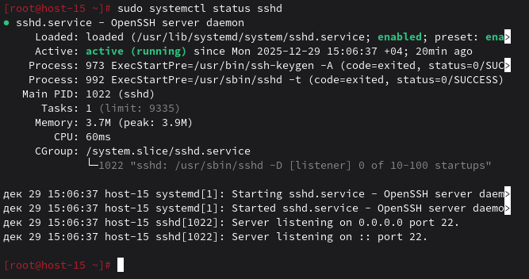
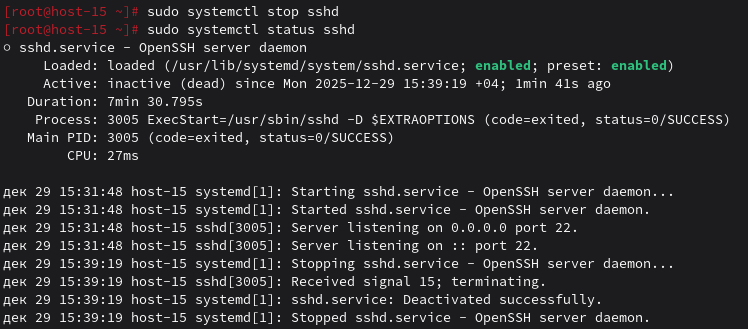
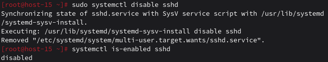
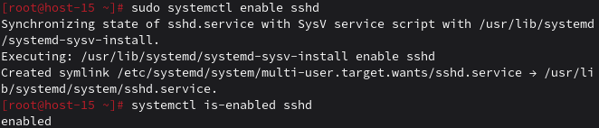

# Юниты

### 1. Что такое systemd юнит?

Systemd юнит - файл конфигурации для управления системными службами, устройствами, точками монтирования и т.д. Типы: service, socket, device, mount, automount, timer, path, target.

### 2. Проверье статус любого systemd юнита, какую информацию выводит эта кманда?

```
sudo systemctl status sshd
```


### 3. ПОпробуйте оставновить сервис.

```
sudo systemctl stop sshd
```
Проверяем
```
sudo systemctl status sshd
```


### 4. Перезапустите его.
```
sudo systemctl restart sshd
```
или остановить + стартовать
```
sudo systemctl stop sshd && sudo systemctl start sshd
```

### 5. УДалите из автозагрузки

```
sudo systemctl disable sshd
```
Проверяем
```
systemctl is-enabled sshd
```


### 6. Верните обратно

```
sudo systemctl enable sshd
```
Проверяем
```
systemctl is-enabled sshd
```


### 7. Что такое таймеры?

Таймеры systemd - аналог cron, запускают службы по расписанию.

Просмотр таймеров
```
systemctl list-timers
systemctl list-timers --all
```
Пример: ежедневное обновление
```
sudo systemctl enable --now apt-daily.timer
```
Создание таймера:

Таймер /etc/systemd/system/mytimer.timer:
```
[Timer]
OnCalendar=daily
Persistent=true
```
Сервис /etc/systemd/system/myscript.service:
```
[Service]
Type=oneshot
ExecStart=/path/to/script.sh
```
