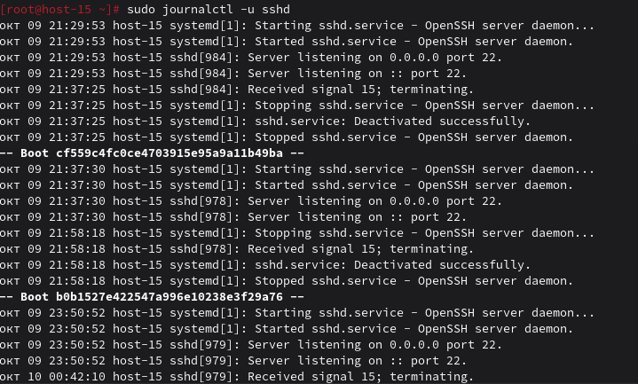
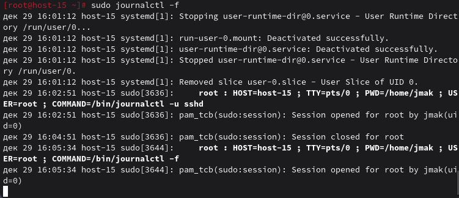
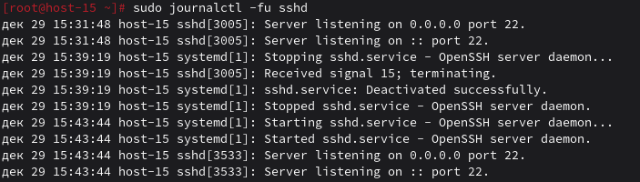

# Журнальчики

### 1. Посмотретите журналы ssh

```
sudo journalctl -u sshd
```


### 2. Выведите журналы в реальном времени

```
sudo journalctl -f
```


### 3. Выведите лог в реальном времени для службы sshd

```
sudo journalctl -fu sshd
```


### 4. Можно ли без комады journalctl прочитать логи systemd?

Да, можно:

1) Через системный журнал
```
sudo cat /var/log/messages | grep sshd
sudo cat /var/log/syslog | grep sshd
```
2) Через собственные логи службы (если настроено)
```
sudo cat /var/log/sshd.log 2>/dev/null || echo "Файла нет"
```
3) Через демона syslog
```
sudo tail -f /var/log/daemon.log
```
4) Через dmesg (логи ядра)
```
sudo dmesg | grep ssh
```

### 5. Сколько будет 2-2?
