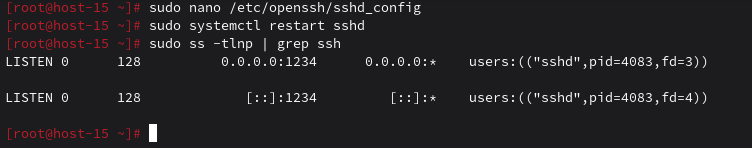
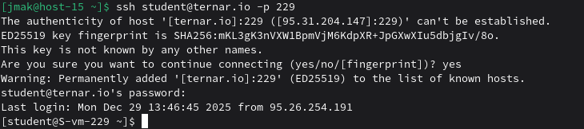
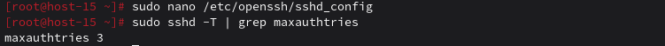
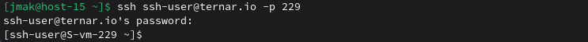
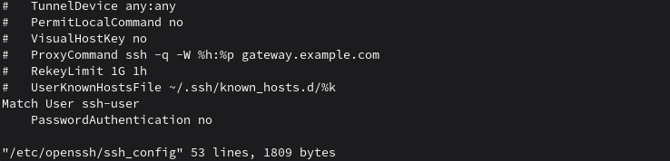

# Настриваем

### 1. Какой по умолчанию используется порт для поключения?

Порт 22.

### 2. Можно ли его изменить? если да то как?

Да, можно. Для этого в файле конфигурации SSH сервера (/etc/openssh/sshd_config) нужно изменить директиву Port.

Редактируем конфиг
```
sudo nano /etc/openssh/sshd_config
```
Находим строку #Port 22, раскомментируем и меняем, например:
```
Port 2222
```
Перезапускаем службу
```
sudo systemctl restart sshd
```
Проверяем, слушает ли новый порт
```
sudo ss -tlnp | grep ssh
```

### 3. Какая служба отвечает за обработку запросов на подключения по ssh?

Демон sshd (OpenSSH server daemon)

### 4. Какой файл конфигурации отвечает за его настройку?

Основной файл конфигурации сервера — /etc/openssh/sshd_config. Для клиента есть /etc/openssh/ssh_config и ~/.openssh/config.

### 5. Попробуйте подключиться по ssh к предоставленному вам серверу

```
ssh student@ternar.io -p 229
```


### 6. Отредактируйте файл настроек на сервере так, чтобы была возможность подключиться к серверу используя пользователя root

1. Редактируем конфиг sshd
```
sudo nano /etc/openssh/sshd_config
```
2. Находим строку (скорее всего закомментирована):
```
# PermitRootLogin prohibit-password
```
Меняем на:
```
PermitRootLogin yes
```
3. Сохраняем файл и перезапускаем sshd
```
sudo systemctl restart sshd
```

### 7. Измените колличество ошибок ввода пароля перед сборосом соединения, покажите эти измененения

 В том же файле /etc/openssh/sshd_config:

Добавляем или изменяем директиву
```
MaxAuthTries 3  # Всего 3 попытки ввода пароля
```
Перезапускаем для применения
```
sudo systemctl restart sshd
```
Проверяем, что настройка применилась
```
sudo sshd -T | grep maxauthtries
```


### 8. Создайте пользователя ssh-user и попробуйте им подключиться к серверу

Создаем пользователя
```
sudo useradd -m -s /bin/bash ssh-user
```
Устанавливаем пароль
```
sudo passwd ssh-user
# Ввод пароля для нового пользователя
```
Пробуем подключиться с локальной машины (выйди с сервера exit)
```
ssh ssh-user@ternar.io -p 229
```


### 9. Ограничте ему возможность подключения к серверу

Подключаемся к серверу
```
ssh student@ternar.io -p 229
```
Редактируем конфиг через vi
```
sudo vi /etc/openssh/sshd_config
```
```
# В vi:
# 1. Нажать Shift+G (перейти в конец файла)
# 2. Нажать o (новая строка и режим вставки)
# 3. Ввести:
Match User ssh-user
    PasswordAuthentication no
# 4. Нажать Esc
# 5. Ввести :wq и Enter
```


### 10. Как вы это сделали?

Использовал директиву Match в sshd_config, которая применяет настройки только к указанному пользователю ssh-user. В этом блоке отключил аутентификацию по паролю (PasswordAuthentication no), оставив только вход по ключу (PubkeyAuthentication yes).

### 11. Что хранится в файле known_hosts?

Файл ~/.ssh/known_hosts хранит отпечатки ключей (fingerprints) серверов, к которым вы подключались. Это защищает от атак "человек посередине" (man-in-the-middle). При первом подключении к новому серверу SSH спрашивает, доверять ли ему, и сохраняет его ключ в этом файле.

Пример содержимого:
```
ternar.io ssh-rsa AAAAB3NzaC1yc2EAAA...DgC9 user@host
```