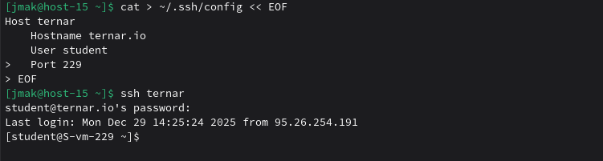

# Конфижим для удобства

### 1. Где хранятся пользвательские и системные настройки подключения?

- Системные: /etc/openssh/ssh_config (в твоём Alt Linux)
- Пользовательские: ~/.ssh/config


### 2. Что за файл options?

Файл ~/.ssh/config (или системный /etc/openssh/ssh_config) - конфиг SSH клиента для удобных подключений.

### 3. Отредактируйте файл options так, чтобы можно было подключаться не вводя имя пользвателя и порт

Создаём пользовательский конфиг (он приоритетнее системного)
```
mkdir -p ~/.ssh
chmod 700 ~/.ssh

vi ~/.ssh/config
```
или создай через echo
```
cat > ~/.ssh/config << 'EOF'
Host ternar
    HostName ternar.io
    User student
    Port 229
EOF
```
Права должны быть 600
```
chmod 600 ~/.ssh/config
```

### 4. Назовите подключение удобным для вас спсобом

ternar (можно server29, lab229, как удобно)

### 5. Проверьте работоспособность

```
ssh ternar
```


