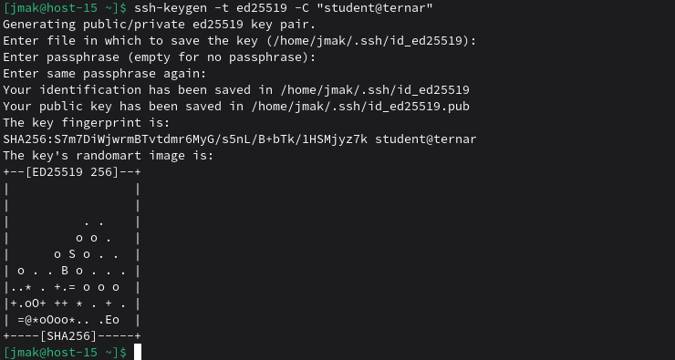

# Ключики

### 1. Что такое ssh ключи и зачем они нужны?

Это пара криптографических ключей (публичный + приватный) для аутентификации без пароля — безопаснее и удобнее.

### 2. Как их создать?

```
ssh-keygen -t ed25519 -C "комментарий"
```

### 3. Создайт пару публичный/приватный ключ ed_25519, где они хранятся?

```
ssh-keygen -t ed25519 -C "student@ternar"
```
- Приватный: ~/.ssh/id_ed25519
- Публичный: ~/.ssh/id_ed25519.pub


### 4. Скопируйте публичный ключ на ваш сервер, в каком файле он будет храниться?

```
ssh-copy-id -i ~/.ssh/id_ed25519.pub -p 229 student@ternar.io
```

### 5. Попробуйте подключиться к серверу, у вас запросили пароль?


Нет, круто

### 6. Запретите подключение с паролем для всех пользователей, оставьте только с помощью ключа.

На сервере в /etc/openssh/sshd_config
```
PasswordAuthentication no
ChallengeResponseAuthentication no
```
Затем:
```
sudo systemctl reload sshd
```
