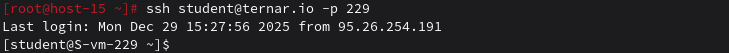
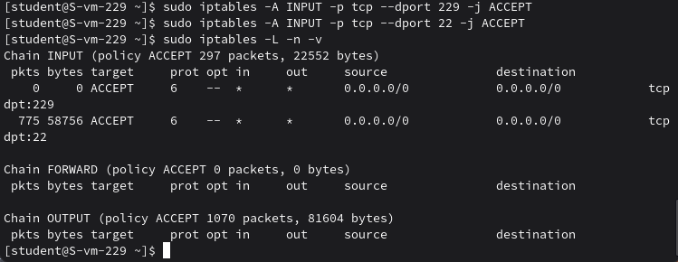

# Открываем iptables

### 1. Установите iptables

```
sudo apt-get install iptables iptables-persistent
```

### 2. Проверьте осталась ли возможность подключения по ssh к вашему серверу

Всё ок!


### 3. Почему может пропасть такая возможность?

Потому что iptables блокирует все входящие соединения по умолчанию, если задана политика DROP для цепочки INPUT.

### 4. Откройте нужный порт на сервере чтобы восстановить подключение

На сервере ternar.io (под student):
```
sudo iptables -A INPUT -p tcp --dport 229 -j ACCEPT
```
или для любого порта SSH:
```
sudo iptables -A INPUT -p tcp --dport 22 -j ACCEPT
```
Проверяем правила
```
sudo iptables -L -n -v
```


### 5. Это будет udp или tcp прот?

TCP - SSH использует протокол TCP (надежная передача данных).

# Сохраняем

### 6. Сохраняются ли записанные вами правила после перезагрузки?

Нет, правила iptables в памяти сбрасываются после перезагрузки.

### 7. Как их сохранить?

Способ 1: iptables-persistent
```
sudo apt-get install iptables-persistent
```
Во время установки спросит - сохранить текущие правила? Да

Способ 2: Вручную
```
sudo iptables-save > /etc/iptables/rules.v4
```
