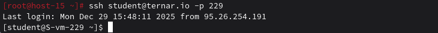
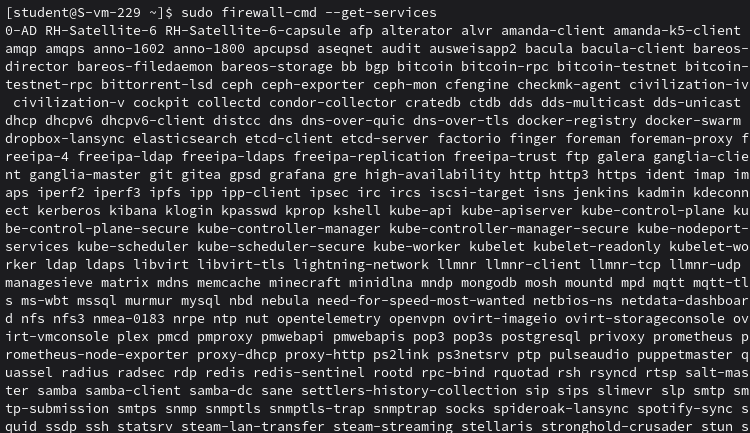
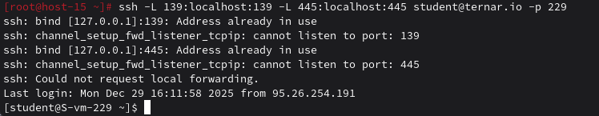

# Открываем firewald

### 1. Удалите iptables и установите firewalld

Удаляем iptables
```
sudo apt-get remove iptables iptables-persistent
```
Устанавливаем firewalld
```
sudo apt-get install firewalld
```
Запуск
```
sudo systemctl start firewalld
```

### 2. Попробуйте так-же проверить возможность подключения по ssh



### 3. Если её нет то откройте порт

Открываем порт 229 для SSH
```
sudo firewall-cmd --add-port=229/tcp --permanent
```

### 4. Выведите список открытых портов с помощью firewall-cmd

```
sudo firewall-cmd --list-ports
sudo firewall-cmd --list-services
sudo firewall-cmd --list-all
```

### 5. Можно ли там добавить порты по названию сервиса?

Да, firewalld работает с предопределёнными сервисами:

Список доступных сервисов
```
sudo firewall-cmd --get-services
```

Примеры:
```
sudo firewall-cmd --add-service=http --permanent
sudo firewall-cmd --add-service=https --permanent
sudo firewall-cmd --add-service=samba --permanent
```

### 6. На вашей Локальной виртуальной машине попробуйте подключиться к серверу samba из предыдущих заданий

Устанавливаем клиент Samba (на своей локальной машине)
```
sudo apt-get install samba-client cifs-utils
```
Пробуем подключиться к тернарному серверу через SSH-туннель
Сначала создаём SSH туннель для Samba портов
```
ssh -L 139:localhost:139 -L 445:localhost:445 student@ternar.io -p 229
```


### 7. Если не получилось то откройте нужные порты

Подключаемся к серверу
```
ssh student@ternar.io -p 229
```
Проверяем запущен ли firewalld
```
sudo firewall-cmd --state
```
Если не запущен - запускаем
```
sudo systemctl start firewalld
sudo systemctl enable firewalld
```
Открываем порты Samba через firewalld
```
sudo firewall-cmd --add-service=samba --permanent
sudo firewall-cmd --add-port=139/tcp --permanent
sudo firewall-cmd --add-port=445/tcp --permanent
sudo firewall-cmd --add-port=137/udp --permanent
sudo firewall-cmd --add-port=138/udp --permanent
```
Перезагружаем правила
```
sudo firewall-cmd --reload
```

### 8. Сделайте так чтобы изменения были постоянными

На сервере ternar.io (все изменения уже с --permanent)
Проверяем что правила сохранены
```
sudo firewall-cmd --list-all --permanent
```
Сохраняем текущую runtime конфигурацию в permanent
```
sudo firewall-cmd --runtime-to-permanent
```
Можно также сохранить конфигурацию в файл
```
sudo firewall-cmd --list-all --permanent > ~/firewall_backup.txt
```
Для надёжности сохраняем зону
```
sudo firewall-cmd --zone=public --list-all --permanent
```
