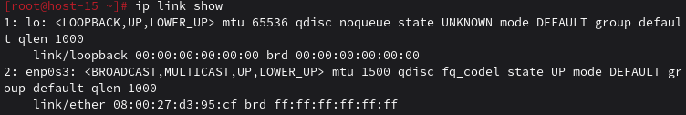
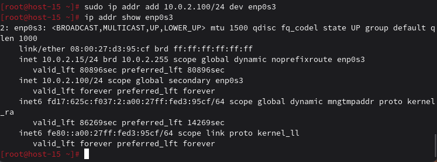
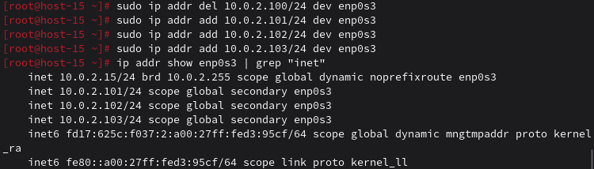
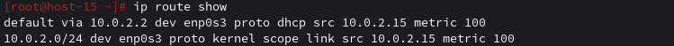
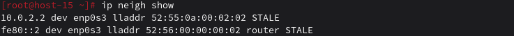

# сети

### 1. Выведите список интерфейсов, какими способами можно это сделать?

```
ip link show
```
или
```
ifconfig
```


### 2. Попробуйте изменить ip адрес

Временно
```
sudo ip addr add 10.0.2.100/24 dev enp0s3
```
Проверить
```
ip addr show enp0s3
```
Удалить временный
```
sudo ip addr del 10.0.2.100/24 dev enp0s3
```


### 3. Попробуте добавить несколько ip адресов на сетевую карту

Добавить три адреса
```
sudo ip addr add 10.0.2.101/24 dev enp0s3
sudo ip addr add 10.0.2.102/24 dev enp0s3
sudo ip addr add 10.0.2.103/24 dev enp0s3
```
Показать все адреса
```
ip addr show enp0s3 | grep "inet "
```


### 4. Выведите список маршрутов

```
ip route show
```


### 5. Выведите arp таблицу

```
ip neigh show
```
Покажет соседей в сети 10.0.2.0/24


### 6. Что такое ip адрес?

Уникальный идентификатор устройства в сети (IPv4: 192.168.1.1)

### 7. Для чего нужны маршруты?

Определяют путь пакетов до других сетей (куда отправлять пакеты)

### 8. Что за протокол arp?

Протокол определения MAC-адреса по IP (Address Resolution Protocol)

### 9. Что такое dhcp?

Протокол автоматической выдачи IP-адресов (Dynamic Host Configuration Protocol)

### 10. Что такое dns?

Система преобразования имён в IP-адреса (Domain Name System)

### 11. Как называется один из протоколов синхронизации времени?

NTP (Network Time Protocol)

### 12. Что такое широковещательный запрос, зачем он нужен?

Пакет для всех устройств в сети. Нужен для поиска (ARP, DHCP)

### 13. Какой адресс является широковещательным?

Pv4: 255.255.255.255 или 192.168.1.255 (для сети 192.168.1.0/24)

### 14. Какие ещё параметры можно задать сетевой карте?

Изменить MTU
```
sudo ip link set enp0s3 mtu 1492
```
Показать настройки
```
ethtool enp0s3
```

### 15. Что такое маска подсети? зачем она нужна?

Определяет границы сети. Пример: /24 = 255.255.255.0 = 254 хоста
